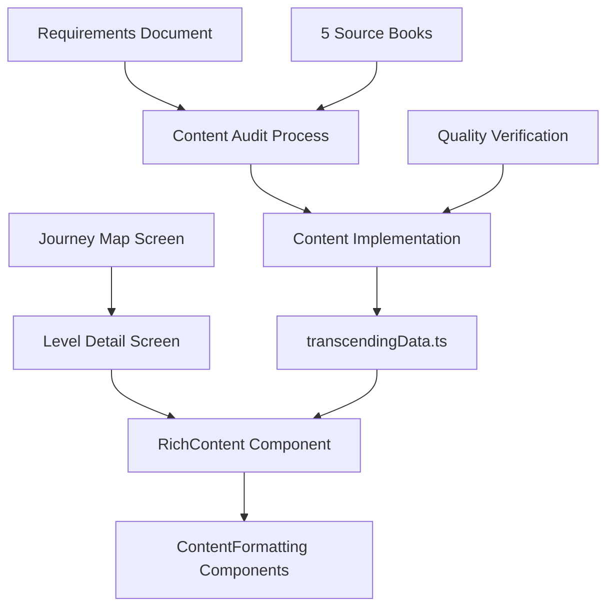
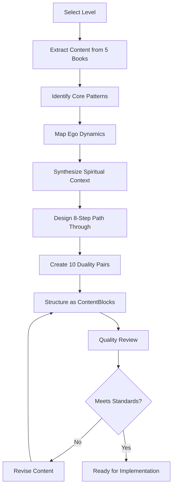

# Design Document: Transcending Cards Phase 4 - Higher Levels Enhancement

## Overview

This design document outlines the comprehensive approach for implementing the remaining 9 consciousness levels (Courage through Enlightenment) in the Transcending Cards application. The project transforms basic text descriptions into rich, actionable content experiences using the established ContentBlock architecture while adapting the content approach for higher consciousness levels.

The design addresses the fundamental shift from "escaping suffering" (lower levels) to "removing blocks" and "stabilizing states" (higher levels), ensuring content appropriately matches the developmental needs of users at different consciousness levels.

## Architecture

### System Context

The Phase 4 enhancement builds upon the existing React Native/Expo application architecture:



### Content Architecture Evolution

The existing ContentBlock system provides the foundation for rich content rendering:

```typescript
export type ContentBlock =
    | { type: 'text'; content: string }
    | { type: 'callout'; variant: 'insight' | 'example' | 'warning' | 'tip'; title?: string; content: string }
    | { type: 'bullets'; items: string[] }
    | { type: 'steps'; items: { title: string; content: string }[] }
    | { type: 'quote'; quote: string; source?: string };
```

This architecture supports the four-section content structure:
- **Core Pattern**: Essential nature and manifestation of the level
- **Ego Dynamics**: How the ego operates at this level  
- **Spiritual Context**: Deeper meaning and karmic factors
- **Path Through**: 8-step actionable guidance for transcendence

## Components and Interfaces

### Content Structure Templates

#### Linear Mind Levels (200-499): Courage, Neutrality, Willingness, Acceptance, Reason

**Template Characteristics:**
- Focus on "removing mental and emotional blocks"
- Emphasis on practical, actionable steps
- Integration of rational understanding with emotional processing
- Content tone: Encouraging, empowering, solution-oriented

**Core Pattern Section:**
```typescript
corePattern: ContentBlock[] = [
    { type: 'text', content: 'Empowering description of the level's positive energy' },
    { type: 'callout', variant: 'example', content: 'Real-life manifestations' },
    { type: 'callout', variant: 'insight', content: 'Key breakthrough insight' }
]
```

**Path Through Adaptation:**
- Steps focus on building capacity and removing limitations
- Emphasis on choice, responsibility, and empowerment
- Integration of mind-body-spirit approaches
- Practical exercises for stabilizing positive states

#### Spiritual Reality Levels (500-600): Love, Joy, Peace

**Template Characteristics:**
- Focus on "stabilizing spiritual states"
- Emphasis on surrender, devotion, and transcendence
- Content tone: Reverent, profound, transformational
- Integration of mystical and practical elements

**Core Pattern Section:**
```typescript
corePattern: ContentBlock[] = [
    { type: 'text', content: 'Transcendent description of the spiritual state' },
    { type: 'quote', quote: 'Authoritative spiritual teaching', source: 'Dr. Hawkins' },
    { type: 'callout', variant: 'insight', content: 'Mystical understanding' }
]
```

**Path Through Adaptation:**
- Steps focus on surrender and letting go of positions
- Emphasis on devotion, service, and unconditional love
- Practices for maintaining high-energy states
- Integration of contemplative and active approaches

#### Enlightenment Level (700+)

**Template Characteristics:**
- Focus on "transcending all positions"
- Emphasis on non-dual awareness and ultimate reality
- Content tone: Profound, paradoxical, pointing beyond concepts
- Minimal conceptual framework, maximum experiential pointing

**Core Pattern Section:**
```typescript
corePattern: ContentBlock[] = [
    { type: 'text', content: 'Paradoxical description pointing beyond description' },
    { type: 'quote', quote: 'Non-dual teaching', source: 'Dr. Hawkins' },
    { type: 'callout', variant: 'warning', content: 'Transcendence of all seeking' }
]
```

### Enhanced ContentBlock Components

#### New Callout Variants for Higher Levels

```typescript
// Extended callout variants for spiritual content
type CalloutVariant = 
    | 'insight'     // Key understanding or realization
    | 'example'     // Real-life application or manifestation  
    | 'warning'     // Important caution or potential pitfall
    | 'tip'         // Practical suggestion or technique
    | 'devotion'    // Spiritual practice or surrender technique (NEW)
    | 'paradox'     // Non-dual pointer or paradoxical truth (NEW)
```

#### Specialized Step Components

```typescript
// Enhanced step structure for Path Through sections
interface PathThroughStep {
    title: string;
    content: string;
    level_category: 'linear_mind' | 'spiritual_reality' | 'enlightenment';
    practice_type: 'mental' | 'emotional' | 'spiritual' | 'integrated';
}
```

### Integration Points

#### RichContent.tsx Enhancement

The existing RichContent component requires minimal modification to support new content:

```typescript
// Current implementation already supports all required ContentBlock types
export function RichContent({ content, accentColor }: RichContentProps) {
    // Existing implementation handles:
    // - text blocks
    // - callout variants (insight, example, warning, tip)
    // - bullet lists
    // - numbered steps
    // - quotes
    
    // No changes required for Phase 4 implementation
}
```

#### LevelDetailScreen.tsx Integration

The screen already conditionally renders transcending content when available:

```typescript
{transcendingContent && transcendingContent.corePattern ? (
    // New rich content structure
    <>
        <CorePatternSection />
        <EgoDynamicsSection />
        <SpiritualContextSection />
        <PathThroughSection />
        <DualitiesSection />
    </>
) : (
    // Fallback to original structure
    <OriginalContentStructure />
)}
```

## Data Models

### Enhanced TranscendingContent Interface

```typescript
export interface TranscendingContent {
    /** The essential nature and manifestation of this level */
    corePattern: ContentBlock[];
    
    /** How the ego operates and manifests at this level */
    egoDynamics: ContentBlock[];
    
    /** Karmic factors, spiritual meaning, deeper context */
    spiritualContext: ContentBlock[];
    
    /** The actual path through and beyond this level - 8 steps */
    pathThrough: ContentBlock[];
    
    /** Transformation pairs: from negative to positive - 10 pairs */
    dualities: Duality[];
    
    // Metadata for content management
    level_category?: 'lower_levels' | 'linear_mind' | 'spiritual_reality' | 'enlightenment';
    content_approach?: 'escape_suffering' | 'remove_blocks' | 'stabilize_states' | 'transcend_positions';
    source_books_referenced?: string[];
    audit_date?: string;
    implementation_date?: string;
}
```

### Level Category Mapping

```typescript
const LEVEL_CATEGORIES = {
    // Lower levels (already implemented)
    shame: 'lower_levels',
    guilt: 'lower_levels', 
    apathy: 'lower_levels',
    grief: 'lower_levels',
    fear: 'lower_levels',
    desire: 'lower_levels',
    anger: 'lower_levels',
    pride: 'lower_levels',
    
    // Linear Mind levels (Phase 4 focus)
    courage: 'linear_mind',
    neutrality: 'linear_mind',
    willingness: 'linear_mind',
    acceptance: 'linear_mind',
    reason: 'linear_mind',
    
    // Spiritual Reality levels (Phase 4 focus)
    love: 'spiritual_reality',
    joy: 'spiritual_reality', 
    peace: 'spiritual_reality',
    
    // Enlightenment (Phase 4 focus)
    enlightenment: 'enlightenment'
} as const;
```

### Content Quality Metrics

```typescript
interface ContentQualityMetrics {
    word_count: number;                    // Target: ~1000 words structured content
    content_blocks: number;                // Target: 8-12 blocks for optimal pacing
    callout_blocks: number;                // Target: 2+ per level for relatability
    path_through_steps: number;            // Required: exactly 8 steps
    duality_pairs: number;                 // Required: exactly 10 pairs
    source_books_coverage: string[];       // Required: all 5 books referenced
    text_block_sentence_count: number[];   // Max: 2-3 sentences per text block
}
```

## Correctness Properties

*A property is a characteristic or behavior that should hold true across all valid executions of a system—essentially, a formal statement about what the system should do. Properties serve as the bridge between human-readable specifications and machine-verifiable correctness guarantees.*

Now I need to analyze the acceptance criteria to determine which are testable as properties.
### Property Reflection

After analyzing the acceptance criteria, several properties can be consolidated to eliminate redundancy:

**Consolidation Decisions:**
- AC-1.1 (9 levels implemented) and AC-7.1 (updates to transcendingData.ts) test the same thing - combine into one property
- AC-4.1 (ContentBlock arrays) and AC-7.3 (TypeScript interfaces) both test data structure compliance - combine
- AC-4.2, AC-4.3, AC-4.4, AC-4.5 all test proper ContentBlock usage - combine into comprehensive property
- AC-3.1, AC-3.2, AC-3.3 all test content approach by level category - combine into one property
- AC-5.4 and AC-7.2 both test RichContent compatibility - combine

**Properties for Implementation:**

Property 1: **Higher Level Data Completeness**
*For all* 9 higher consciousness levels (courage, neutrality, willingness, acceptance, reason, love, joy, peace, enlightenment), the transcendingData structure should contain complete entries with all 4 required sections (corePattern, egoDynamics, spiritualContext, pathThrough) as ContentBlock arrays
**Validates: Requirements AC-1.1, AC-1.2, AC-4.1, AC-7.1, AC-7.3**

Property 2: **Path Through Structure Consistency**
*For all* higher consciousness levels, the pathThrough section should contain exactly 8 step-type ContentBlocks with title and content properties
**Validates: Requirements AC-1.3, AC-4.4**

Property 3: **Duality Pairs Completeness**
*For all* higher consciousness levels, the dualities array should contain exactly 10 transformation pairs with 'from' and 'to' properties
**Validates: Requirements AC-1.4**

Property 4: **Shared Experience Language**
*For all* text content in higher consciousness levels, the language should use "we" pronouns instead of "you" or "I" to maintain shared human experience perspective
**Validates: Requirements AC-2.1**

Property 5: **Calibration Reference Filtering**
*For all* text content in higher consciousness levels, no numerical calibration references should appear in user-facing content
**Validates: Requirements AC-2.2**

Property 6: **Content Block Type Compliance**
*For all* higher consciousness levels, ContentBlocks should use appropriate types and variants: callout blocks should use valid variants (example, warning, insight, tip), example callouts should be present, quotes should have source attribution, and steps should only appear in pathThrough sections
**Validates: Requirements AC-2.3, AC-4.2, AC-4.3, AC-4.5**

Property 7: **Content Length Standards**
*For all* higher consciousness levels, the total word count across all ContentBlocks should be approximately 1000 words (±200 words), and individual text-type ContentBlocks should contain 2-3 sentences maximum
**Validates: Requirements AC-2.5, AC-2.6**

Property 8: **Level-Appropriate Content Approach**
*For all* higher consciousness levels, the content approach should match the level category: linear mind levels (200-499) should focus on removing blocks, spiritual reality levels (500-600) should focus on stabilizing states, and enlightenment level (700+) should focus on transcending positions
**Validates: Requirements AC-3.1, AC-3.2, AC-3.3, AC-3.4, AC-3.5**

Property 9: **Visual Content Variety**
*For all* higher consciousness levels, the content should use at least 3 different ContentBlock types to ensure visual pacing and variety
**Validates: Requirements AC-6.2**

Property 10: **RichContent Rendering Compatibility**
*For all* higher consciousness levels, the ContentBlock arrays should render successfully through the existing RichContent component without errors, maintaining backward compatibility with existing lower level content
**Validates: Requirements AC-5.4, AC-7.2, AC-7.4**

Property 11: **Navigation Integration**
*For all* higher consciousness level IDs, navigation from Journey Map to LevelDetailScreen should work seamlessly
**Validates: Requirements AC-6.1**

## Content Creation Workflow

### Phase 1: Content Audit and Research

#### Source Material Analysis
Each level requires comprehensive analysis across Dr. Hawkins' 5 core books:

1. **Transcending the Levels of Consciousness** - Primary structural reference
2. **Power vs Force** - Foundational level descriptions and characteristics  
3. **Letting Go** - Practical techniques and emotional processing
4. **Healing & Recovery** - Integration and stabilization approaches
5. **Truth vs Falsehood** - Spiritual context and higher-level insights

#### Content Audit Process



#### Content Audit Template

For each level, create a structured audit document:

```markdown
# [Level Name] Content Audit

## Source Material Coverage
- [ ] Transcending the Levels of Consciousness: Pages X-Y
- [ ] Power vs Force: Pages X-Y  
- [ ] Letting Go: Pages X-Y
- [ ] Healing & Recovery: Pages X-Y
- [ ] Truth vs Falsehood: Pages X-Y

## Core Pattern Synthesis
- Essential nature of the level
- How it manifests in daily life
- Key breakthrough insights
- Real-life examples

## Ego Dynamics Analysis
- How the ego operates at this level
- Common manifestations and behaviors
- Hidden payoffs and resistances
- Transition mechanisms

## Spiritual Context Integration
- Karmic factors and spiritual meaning
- Evolutionary significance
- Relationship to other levels
- Transcendent perspective

## Path Through Design
1. [Step 1 Title]: [Specific action/technique]
2. [Step 2 Title]: [Specific action/technique]
...
8. [Step 8 Title]: [Specific action/technique]

## Duality Pairs
1. From: [Negative state] → To: [Positive state]
2. From: [Negative state] → To: [Positive state]
...
10. From: [Negative state] → To: [Positive state]

## Quality Checklist
- [ ] Uses "we" language throughout
- [ ] No numerical calibrations
- [ ] ~1000 words total
- [ ] 2-3 sentences per text block
- [ ] Appropriate level category approach
- [ ] Real-life examples included
- [ ] Source fidelity maintained
```

### Phase 2: ContentBlock Implementation

#### Content Structure Mapping

Transform audit content into ContentBlock arrays:

```typescript
// Example implementation structure
const courageContent: TranscendingContent = {
    corePattern: [
        { type: 'text', content: 'Opening description...' },
        { type: 'callout', variant: 'example', content: 'Real-life manifestation...' },
        { type: 'callout', variant: 'insight', content: 'Key breakthrough...' }
    ],
    
    egoDynamics: [
        { type: 'text', content: 'Ego operation description...' },
        { type: 'bullets', items: ['Manifestation 1', 'Manifestation 2', ...] },
        { type: 'callout', variant: 'warning', content: 'Common trap...' }
    ],
    
    spiritualContext: [
        { type: 'quote', quote: 'Authoritative teaching', source: 'Dr. Hawkins' },
        { type: 'text', content: 'Spiritual significance...' },
        { type: 'callout', variant: 'tip', content: 'Spiritual practice...' }
    ],
    
    pathThrough: [
        { type: 'text', content: 'Introduction to the path...' },
        { type: 'steps', items: [
            { title: 'Step 1', content: 'Specific technique...' },
            // ... 8 total steps
        ]},
        { type: 'callout', variant: 'tip', content: 'Daily practice...' },
        { type: 'quote', quote: 'Closing wisdom', source: 'Dr. Hawkins' }
    ],
    
    dualities: [
        { from: 'Negative state', to: 'Positive state' },
        // ... 10 total pairs
    ]
};
```

#### Implementation Sequence

**Batch 1: Linear Mind Levels (200-499)**
1. Courage (200) - The threshold level, foundational
2. Neutrality (250) - Emotional balance and objectivity  
3. Willingness (310) - Openness to growth and change
4. Acceptance (350) - Embracing reality as it is
5. Reason (400) - Intellectual understanding and logic

**Batch 2: Spiritual Reality Levels (500-600)**
6. Love (500) - Unconditional love and compassion
7. Joy (540) - Inner happiness independent of conditions
8. Peace (600) - Transcendent tranquility and bliss

**Batch 3: Enlightenment Level (700+)**
9. Enlightenment (700-1000) - Non-dual awareness and ultimate reality

### Phase 3: Quality Assurance and Verification

#### Automated Quality Checks

Implement property-based tests to verify:
- Content structure compliance
- Language pattern adherence  
- Length and formatting standards
- ContentBlock type usage
- Integration compatibility

#### Manual Quality Review

Each level undergoes comprehensive review:
- Source fidelity verification
- Content flow and readability
- Spiritual accuracy and depth
- Practical applicability
- User experience optimization

#### Integration Testing

Verify seamless integration with:
- RichContent rendering system
- LevelDetailScreen display
- Journey Map navigation
- Mobile responsiveness
- Theme compatibility

## Error Handling

### Content Validation

```typescript
interface ContentValidationResult {
    isValid: boolean;
    errors: ContentValidationError[];
    warnings: ContentValidationWarning[];
}

interface ContentValidationError {
    level: string;
    section: 'corePattern' | 'egoDynamics' | 'spiritualContext' | 'pathThrough' | 'dualities';
    type: 'missing_section' | 'invalid_structure' | 'content_violation';
    message: string;
}
```

### Graceful Degradation

The system maintains backward compatibility:
- If new content is malformed, falls back to original structure
- Partial content loads with warnings rather than complete failure
- Missing sections display appropriate placeholders
- Invalid ContentBlocks are skipped with logging

### Content Loading States

```typescript
type ContentLoadingState = 
    | 'loading'
    | 'loaded'
    | 'error'
    | 'fallback';

// Handle different states in LevelDetailScreen
const renderContent = (state: ContentLoadingState, content: TranscendingContent) => {
    switch (state) {
        case 'loading':
            return <ContentSkeleton />;
        case 'loaded':
            return <RichContentStructure content={content} />;
        case 'error':
            return <ErrorMessage />;
        case 'fallback':
            return <OriginalContentStructure />;
    }
};
```

## Testing Strategy

### Dual Testing Approach

The testing strategy employs both unit tests and property-based tests to ensure comprehensive coverage:

**Unit Tests** focus on:
- Specific content examples and edge cases
- Integration points between components
- Error conditions and fallback scenarios
- Individual ContentBlock rendering
- Navigation flow verification

**Property Tests** focus on:
- Universal properties that hold for all higher levels
- Content structure compliance across all levels
- Language pattern consistency
- ContentBlock type usage rules
- Integration compatibility guarantees

### Property-Based Testing Configuration

Using **fast-check** for TypeScript property-based testing:
- Minimum 100 iterations per property test
- Each property test references its design document property
- Tag format: **Feature: transcending-cards-phase4, Property {number}: {property_text}**

### Test Implementation Examples

```typescript
// Property test for content completeness
describe('Higher Level Content Properties', () => {
    test('Property 1: Higher Level Data Completeness', () => {
        fc.assert(fc.property(
            fc.constantFrom(...HIGHER_LEVEL_IDS),
            (levelId) => {
                const content = getTranscendingContent(levelId);
                expect(content).toBeDefined();
                expect(content.corePattern).toBeInstanceOf(Array);
                expect(content.egoDynamics).toBeInstanceOf(Array);
                expect(content.spiritualContext).toBeInstanceOf(Array);
                expect(content.pathThrough).toBeInstanceOf(Array);
                expect(content.corePattern.length).toBeGreaterThan(0);
                expect(content.egoDynamics.length).toBeGreaterThan(0);
                expect(content.spiritualContext.length).toBeGreaterThan(0);
                expect(content.pathThrough.length).toBeGreaterThan(0);
            }
        ), { numRuns: 100 });
        // Feature: transcending-cards-phase4, Property 1: Higher Level Data Completeness
    });
    
    test('Property 2: Path Through Structure Consistency', () => {
        fc.assert(fc.property(
            fc.constantFrom(...HIGHER_LEVEL_IDS),
            (levelId) => {
                const content = getTranscendingContent(levelId);
                const stepsBlocks = content.pathThrough.filter(block => block.type === 'steps');
                expect(stepsBlocks.length).toBeGreaterThan(0);
                
                const totalSteps = stepsBlocks.reduce((sum, block) => 
                    sum + (block.type === 'steps' ? block.items.length : 0), 0);
                expect(totalSteps).toBe(8);
            }
        ), { numRuns: 100 });
        // Feature: transcending-cards-phase4, Property 2: Path Through Structure Consistency
    });
});

// Unit test for specific integration scenarios
describe('RichContent Integration', () => {
    test('renders courage level content without errors', () => {
        const courageContent = getTranscendingContent('courage');
        const { getByText } = render(
            <RichContent content={courageContent.corePattern} accentColor="#FF6B6B" />
        );
        expect(getByText).toBeDefined();
    });
    
    test('handles malformed content gracefully', () => {
        const malformedContent = [{ type: 'invalid', content: 'test' }];
        expect(() => {
            render(<RichContent content={malformedContent} accentColor="#FF6B6B" />);
        }).not.toThrow();
    });
});
```

### Content Quality Metrics Testing

```typescript
// Property test for content quality standards
test('Property 7: Content Length Standards', () => {
    fc.assert(fc.property(
        fc.constantFrom(...HIGHER_LEVEL_IDS),
        (levelId) => {
            const content = getTranscendingContent(levelId);
            const totalWordCount = calculateWordCount(content);
            expect(totalWordCount).toBeGreaterThanOrEqual(800);
            expect(totalWordCount).toBeLessThanOrEqual(1200);
            
            const textBlocks = getAllTextBlocks(content);
            textBlocks.forEach(block => {
                const sentenceCount = countSentences(block.content);
                expect(sentenceCount).toBeLessThanOrEqual(3);
                expect(sentenceCount).toBeGreaterThanOrEqual(1);
            });
        }
    ), { numRuns: 100 });
    // Feature: transcending-cards-phase4, Property 7: Content Length Standards
});
```

This comprehensive design provides the foundation for implementing Phase 4 of the Transcending Cards enhancement, ensuring high-quality, spiritually accurate content that serves users at higher consciousness levels while maintaining technical excellence and user experience standards.